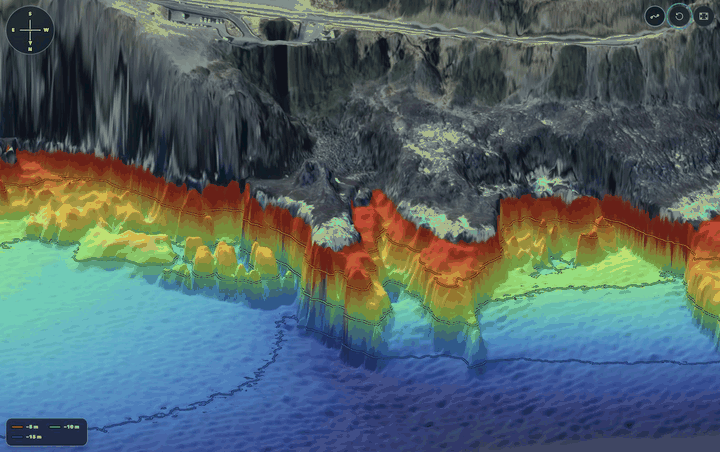
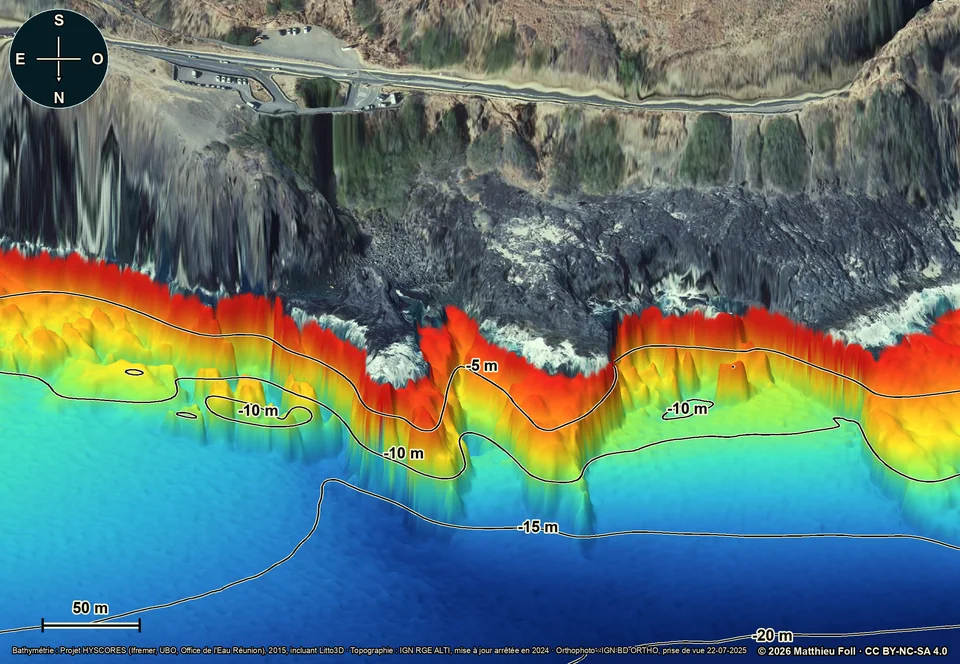
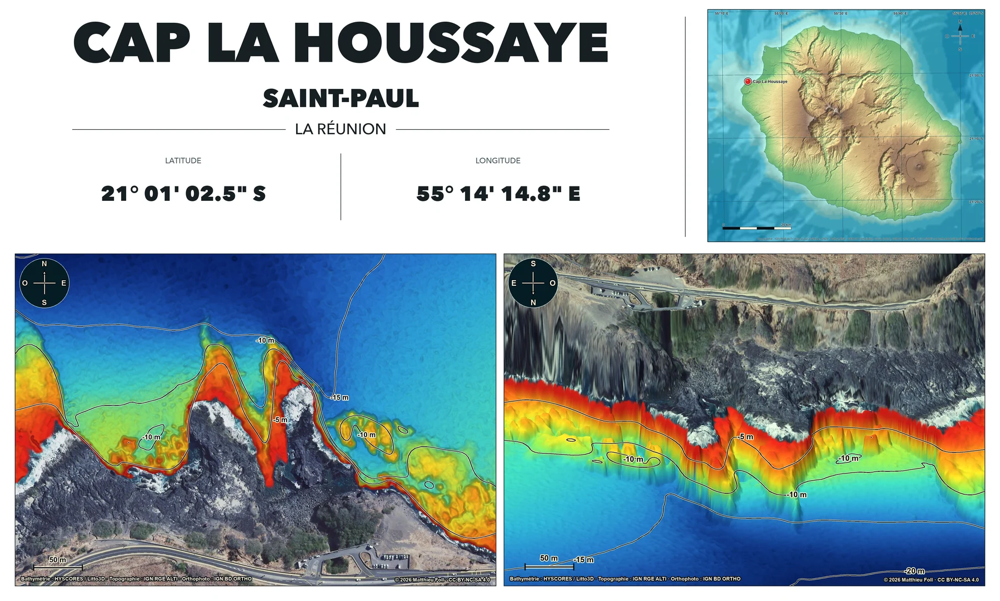

[**English**](README.md) · [Français](README.fr.md)

# DiveTopo

> [!IMPORTANT]
> Explore the maps, interactive 3D terrain and original high-resolution downloads for DiveTopo's regional collections at **[divetopo.com](https://divetopo.com)**.

[](https://divetopo.com/reunion)

## Why this project exists

While preparing a trip to Réunion Island, I found it surprisingly difficult to
locate detailed maps of its dive sites. Further research showed that useful
public bathymetric, topographic and aerial data already existed, but was not
easy to inspect together. That first regional collection became the starting
point for a reusable project covering multiple regions.

I downloaded and assembled these datasets to produce consistent 2D maps,
static 3D perspectives, interactive terrain and printable sheets for a small,
non-exhaustive selection of sites. DiveTopo now separates the reusable mapping
engine and Web application from the sources and configurations of each region,
so other regions can be added without copying the code.

> [!NOTE]
> The codebase, website and original presentation were generated entirely with AI, under human direction, iterative visual review and validation against the source data. Each region documents its own geographic sources, licences and attributions.

## Regional data sources and attributions

Source datasets, coverage, projections, licences and required attributions are
defined per region. The following Réunion collection is a regional example,
not a universal source list or processing requirement for other regions.

### Réunion Island

| Used for | Source | Role |
|---|---|---|
| Detailed seabed terrain | [Ifremer HYSCORES 2015](https://www.data.gouv.fr/datasets/mnt-bathymetrique-a-haute-resolution-des-fonds-marins-des-zones-recifales-de-la-cote-ouest-de-lile-de-la-reunion-2015) | High-resolution bathymetry for the west-coast reef sectors, including the Litto3D additions distributed with HYSCORES |
| Land elevation | [IGN RGE ALTI](https://cartes.gouv.fr/rechercher-une-donnee/dataset/IGNF_RGE-ALTI) | Digital terrain model for the land surface |
| Aerial imagery | [IGN BD ORTHO](https://cartes.gouv.fr/rechercher-une-donnee/dataset/IGNF_BD-ORTHO) | Georeferenced imagery draped over land and, where configured, shallow water |
| Regional context | [GEBCO 2024](https://www.gebco.net/data-products-gridded-bathymetry-data/gebco2024-grid) | Generalized seabed relief for the locator and regional selection map |

Detailed Réunion processing uses WGS 84 / UTM zone 40S (`EPSG:32740`).
HYSCORES does not cover the whole island; a site outside its four published
sectors requires another numerical bathymetric source.

At Pointe au Sel, a small inconsistent HYSCORES patch is corrected from the
older [Shom survey S199503500](https://doi.org/10.17183/S199503500). The
soundings are used as local depth controls after robust vertical alignment;
the high-resolution HYSCORES texture is retained and the correction is
progressively feathered outside the diagnosed area.

## What the pipeline produces

Each site configuration can produce:

- a north-up 2D map;
- a static oblique 3D perspective;
- topographic and aerial-imagery variants;
- a regional locator;
- two printable high-resolution sheets;
- a compact interactive 3D terrain package consumed by the website.

Dimensions, transition thresholds and contour intervals are defined per region.
The seven current Réunion sites share `2474 × 1712 px` static maps and
`5400 × 3250 px` printable sheets. Aerial imagery remains opaque down to
`−1.5 m`, fades to the bathymetric palette between `−1.5 m` and `−2 m`, and is
fully absent below `−2 m`. Isobaths are derived every 5 m.

## Regional inventories

Each region maintains its own identity, site inventory and canonical outputs
under `regions/<slug>/`. The Réunion inventory below is included as a concrete
example; other regions must be read from their own configurations and any
available regional notices.

### Réunion Island

| Site | Municipality | Configuration |
|---|---|---|
| Cap La Houssaye | Saint-Paul | [`cap-la-houssaye.json`](regions/reunion/sites/cap-la-houssaye.json) |
| Boucan Canot | Saint-Paul | [`boucan-canot.json`](regions/reunion/sites/boucan-canot.json) |
| Passe de l'Hermitage | Saint-Paul | [`passe-hermitage.json`](regions/reunion/sites/passe-hermitage.json) |
| Cap Homard | Saint-Paul | [`cap-homard.json`](regions/reunion/sites/cap-homard.json) |
| Pointe au Sel | Saint-Leu | [`pointe-au-sel-sec-jaune.json`](regions/reunion/sites/pointe-au-sel-sec-jaune.json) |
| Pont Rouge | Saint-Leu | [`pont-rouge-la-tortue.json`](regions/reunion/sites/pont-rouge-la-tortue.json) |
| Plage du Cimetière | Saint-Leu | [`plage-cimetiere-saint-leu.json`](regions/reunion/sites/plage-cimetiere-saint-leu.json) |

## Representative example: Cap La Houssaye

| 2D map | Static 3D perspective |
|---|---|
| [](https://divetopo.com/reunion) | [](https://divetopo.com/reunion) |

### Printable sheet

[](https://divetopo.com/reunion)

These are lightweight previews. The website's download controls serve the
canonical full-resolution JPEGs and sheets.

## Repository architecture

```text
apps/web/                  single Web application deployed at divetopo.com
cartography/               shared rendering, composition and terrain exporters
cartography/regions/       region-specific acquisition and orchestration
regions/<slug>/region.json regional identity, projection, sources and inventory
regions/<slug>/sites/      reproducible site configurations
regions/<slug>/outputs/    canonical generated cartographic artifacts
tests/                     shared and regional contract tests
```

The website never generates terrain. It copies verified responsive derivatives
from the canonical regional outputs. The interactive package format is
documented in [INTERACTIVE-TERRAIN.md](INTERACTIVE-TERRAIN.md).

## Regional workflows

Use the workflow under the target region's directory for source-specific
acquisition, rendering parameters and acceptance checks. The commands below
show the current Réunion implementation.

Install the local macOS environment:

```bash
./bootstrap_macos.sh
```

Validate one configuration and its cached source rasters:

```bash
.venv/bin/python -m cartography.regions.reunion \
  regions/reunion/sites/cap-la-houssaye.json --check
```

Refresh the official data and regenerate the maps:

```bash
.venv/bin/python -m cartography.regions.reunion \
  regions/reunion/sites/cap-la-houssaye.json --refresh
```

Rebuild the printable sheets or the canonical interactive package:

```bash
.venv/bin/python -m cartography.plate \
  regions/reunion/sites/cap-la-houssaye.json
.venv/bin/python -m cartography.interactive
```

The shared rules are in [WORKFLOW.md](WORKFLOW.md); source-specific parameters,
rendering controls and acceptance gates are in the applicable regional workflow,
for example [regions/reunion/WORKFLOW.md](regions/reunion/WORKFLOW.md).

## Website and release model

`apps/web/` serves the general homepage and every regional route from one
deployment. Each region supplies its own route and site inventory. The current
Réunion collection is published under `/reunion`, with dedicated French and
English routes and indexable site routes below it. GitHub is the canonical
source; publishing the repository does not automatically deploy the hosted
site. See [DEPLOYMENT.md](DEPLOYMENT.md).

## Licences and safety

- Original software: [MIT](LICENSE).
- Original maps and figures: [CC BY-NC-SA 4.0](LICENSE-MAPS.md), to the extent
  of the rights held by Matthieu Foll in those original contributions.
- Regional dataset licences, mandatory attributions and warnings:
  [third-party notices](THIRD-PARTY-NOTICES.md) and any applicable notice under
  `regions/<slug>/`.

The website and its content are free to access and contain no advertising.
Maps help interpret terrain and general orientation. They do not establish
access, authorization, present conditions or safety, and must not be used for
navigation or as the sole basis of a decision affecting safety at sea.
