# Topo-bathymetrie des sites de plongee de La Reunion

Pipeline reproductible pour produire un plan 2D, une vue 3D oblique et une carte de localisation insulaire a partir de donnees officielles : bathymetrie HYSCORES de l'Ifremer et topographie RGE ALTI de l'IGN. Une variante optionnelle drape l'orthophoto IGN georeferencee sur la terre et, pour les grands lagons, jusqu'a une profondeur configurable. Chaque site porte ses propres emprises, dates de prise de vue et references de sources dans un fichier JSON.

Le standard orthophoto courant est commun aux sept sites : image opaque jusqu'a `-1,5 m`, fondu lisse jusqu'a `-2 m`, aucun trait de cote 0 m, puis palette bathymetrique rouge a partir de `-2 m`. Les variantes topographiques conservent leur trait de cote. Le masque de l'orthophoto est aligne sur la grille de profondeur et transforme en parallele du relief 3D; l'image reste ainsi bornee par le masque bathymetrique configure.

Les sept sites utilisent les memes dimensions finales (`2474 x 1712 px`) et le meme facteur `map_style_scale: 2.0`. Les isobathes, etiquettes, roses, barres d'echelle, sources et licences conservent ainsi la meme epaisseur et le meme corps apparent, independamment de l'emprise ou de la perspective. Les planches mesurent toutes `5400 x 3250 px` et affichent les coordonnees en degres, minutes et secondes. Leur cartouche utilise toujours trois lignes distinctes : un seul nom canonique de site, la commune, puis `La Reunion` seule. Deux filets courts encadrent lateralement `La Reunion`; aucun filet horizontal ne la souligne et aucun cadre ou fond gris n'enferme le texte.

Le moteur fusionne les deux MNT, interpole la cote a 0 m, lisse le bruit de cellule, extrait les isobathes tous les 5 m jusqu'a `max_depth_m`, puis ajoute une rose des vents et une echelle metrique. Les plans 2D et les vues 3D statiques utilisent en haut a gauche la meme rose circulaire que le relief interactif; son cadran suit l'orientation geographique tandis que les lettres restent droites. Par defaut, les lacunes restent absentes. Un plan 2D peut seulement afficher une lacune marine profonde ouverte sur le bord avec la couleur de sa profondeur maximale, sans y creer de contour. Une configuration peut aussi completer explicitement ce type de limite par un plateau uniforme dans les terrains 3D, sans relief intermediaire. Chaque site est defini par un fichier JSON distinct.

Pointe au Sel constitue une exception explicite de presentation : la marge sud-ouest du raster HYSCORES contient des facettes triangulees peu fiables en grande profondeur. Le plan 2D conserve donc les donnees utiles jusqu'a `-30 m`, tandis que les reliefs statique et interactif vont jusqu'a `-40 m`. La perspective statique reprend le cadrage valide a `60°` sur `1200 × 1400 m`, avec une largeur visible de `900 m` et un centre decale de `50 m` vers le nord. Le paquet interactif utilise un rectangle de `1040 × 1545 m`, centre sur `[321581.5, 7654180.4]` et oriente a `60°`, recadre dans les rasters de contexte pour conserver davantage de terre et de fond au nord. Les grandes lacunes marines de bord dont tous les voisins marins connus sont profonds d'au moins `20 m` sont completees localement par un plateau uniforme a `-40 m`; les isobathes en restent exclues. Une lacune interne de `19,2 m²` est en outre interpolee uniquement dans le maillage 3D statique, apres l'extraction des contours. Aucune terre, lacune cotiere ou zone peu profonde n'est completee.

## Sites publies

| Site imprime | Commune | Configuration | Orthophoto 2D | Texture orthophoto 3D | Prise de vue |
|---|---|---|---:|---:|---|
| Cap La Houssaye | Saint-Paul | [`cap-la-houssaye.json`](sites/cap-la-houssaye.json) | 20 cm | 20 cm | 22 juillet 2025 |
| Boucan Canot | Saint-Paul | [`boucan-canot.json`](sites/boucan-canot.json) | 20 cm | 40 cm | 22 juillet 2025 |
| Passe de l'Hermitage | Saint-Paul | [`passe-hermitage.json`](sites/passe-hermitage.json) | 20 cm | 80 cm | 2 aout 2025 |
| Cap Homard | Saint-Paul | [`cap-homard.json`](sites/cap-homard.json) | 20 cm | 40 cm | 22 juillet 2025 |
| Pointe au Sel | Saint-Leu | [`pointe-au-sel-sec-jaune.json`](sites/pointe-au-sel-sec-jaune.json) | 40 cm | 50 cm | 22 juillet 2025 |
| Pont Rouge | Saint-Leu | [`pont-rouge-la-tortue.json`](sites/pont-rouge-la-tortue.json) | 20 cm | 50 cm | 22 juillet 2025 |
| Plage du Cimetière | Saint-Leu | [`plage-cimetiere-saint-leu.json`](sites/plage-cimetiere-saint-leu.json) | 20 cm | 40 cm | 22 juillet 2025 |

Les trois sections suivantes montrent des exemples de planches; les sept configurations et leurs sorties canoniques suivent le meme workflow.

## Exemple : Cap La Houssaye

Le Cap applique le standard orthophoto `-1,5/-2 m` et la palette decalee, tout en conservant sa correction locale du pont dans le modele 3D. Sa vue oblique finale utilise une inclinaison de `0,29`, une amplification dans l'axe de vue de `1,35` et place la cote a 54 % de la hauteur afin de montrer les deux pointes sans consacrer trop d'espace au fond uniforme du large.

| Plan 2D | Vue 3D depuis le large |
|---|---|
| 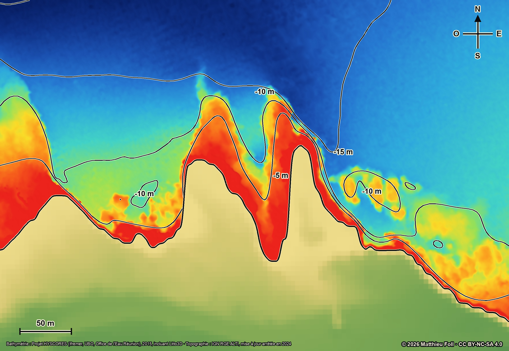 | 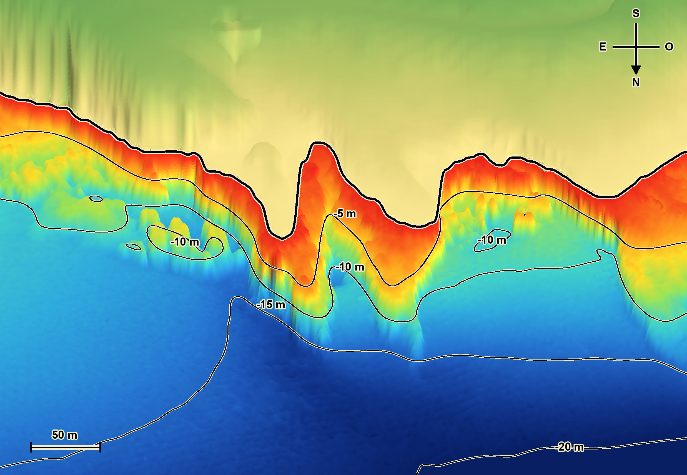 |

### Variantes avec orthophoto terrestre

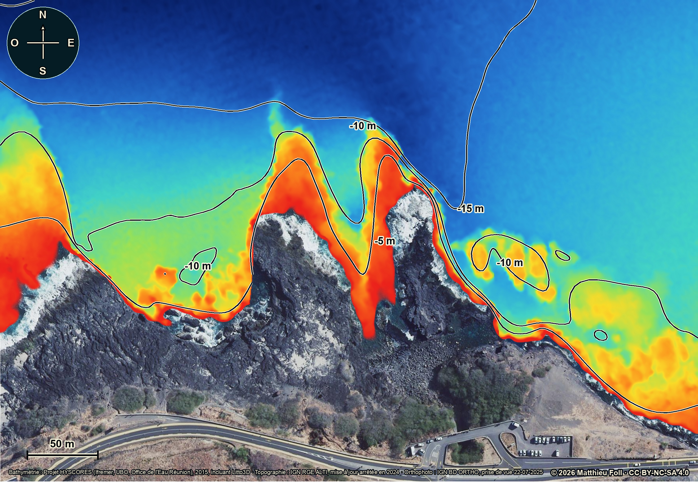

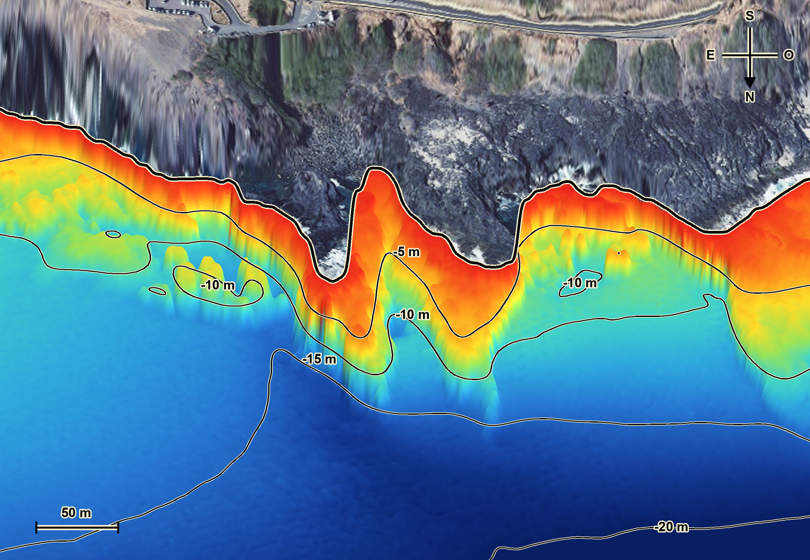

### Localisation dans l'ile

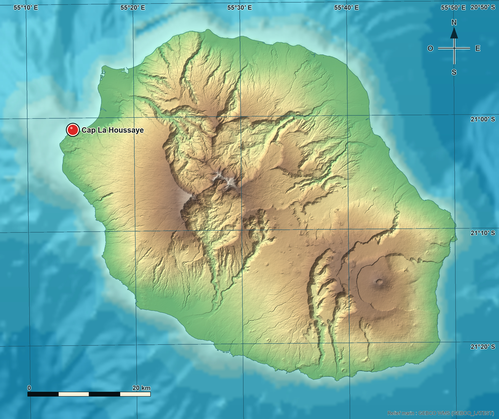

### Planche assemblee

| Terre en orthophoto | Terre en relief topographique |
|---|---|
| 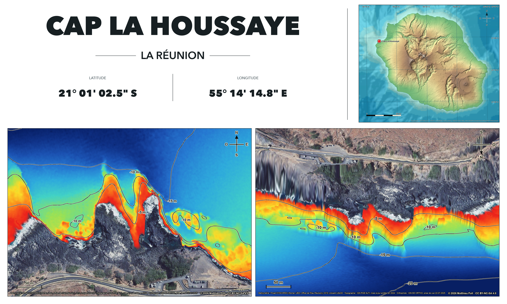 | 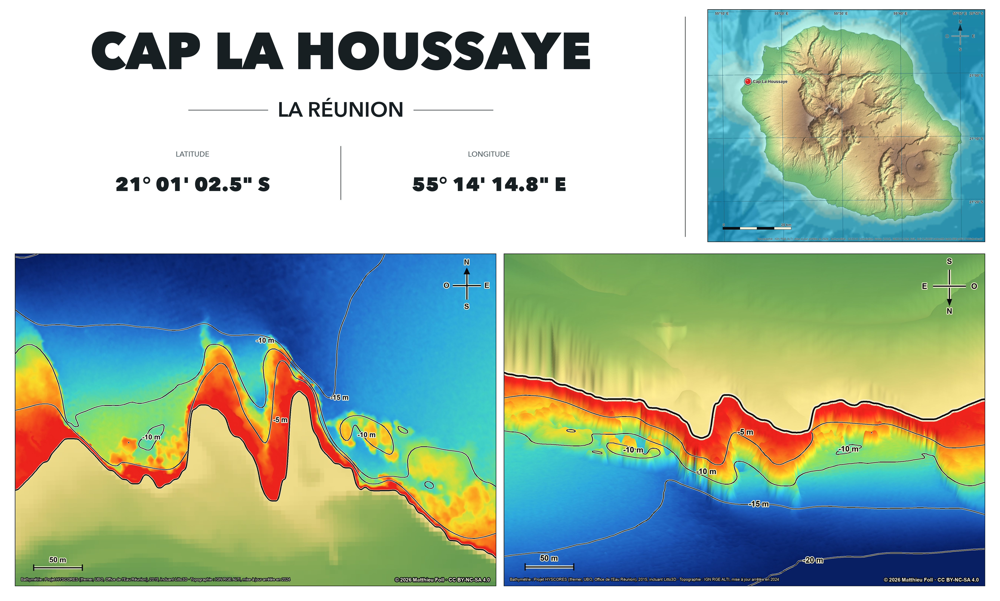 |

## Exemple : Boucan Canot

La configuration Boucan utilise une cote bidimensionnelle pour la piscine naturelle et une camera orientee au sud-est (`135°`). Son emprise 2D est decalee de 12 m vers l'est afin d'exclure une couture sans donnee situee dans le grand fond nord-ouest, sans retirer la piscine ni les reliefs utiles. Son cadrage 3D rapproche le relief sous-marin avec une largeur visible de `580 m`, independamment de l'emprise 2D. L'orthophoto est prolongee sans rupture jusqu'a `-1,5 m`, puis fondue progressivement jusqu'a `-2 m` afin d'eviter les artefacts du masque terrestre autour de la piscine.

| Terre en orthophoto | Terre en relief topographique |
|---|---|
| 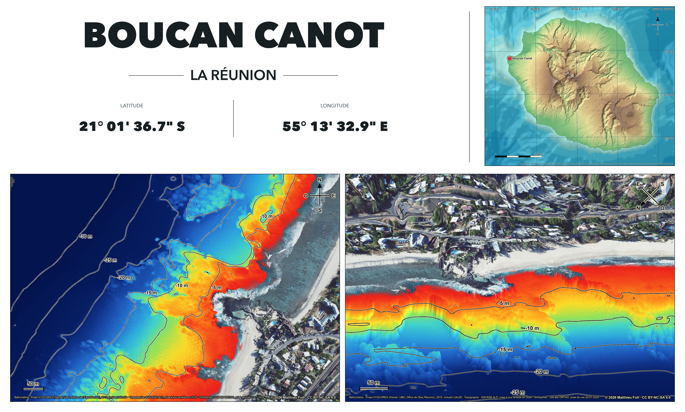 | 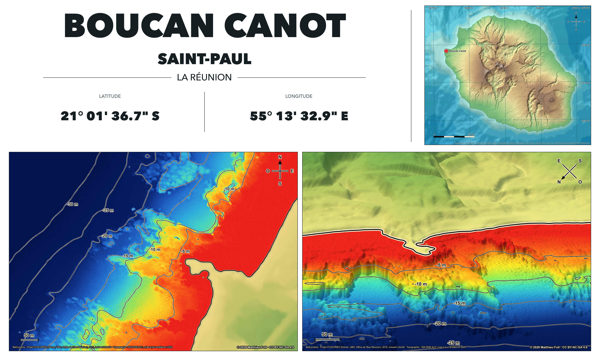 |

## Exemple : Passe de l'Hermitage

La vue 3D regarde vers le nord-est (`45°`). Son centre est decale de `140 m` vers l'est et `240 m` vers le nord, avec une largeur visible de `650 m` et la cote placee a 26 % de la hauteur pour garder la passe au coeur du cadrage sans donner trop de place au large. L'orthophoto reste opaque jusqu'a `-1,5 m`, puis disparait progressivement a `-2 m`, avec une limite bathymetrique lissee sur 5 m. Le trait de cote est masque sur la variante orthophoto et le premier plan conserve les isobathes jusqu'a la profondeur maximale du site, soit `-30 m`.

| Terre et lagon en orthophoto | Relief topographique et bathymetrique |
|---|---|
| 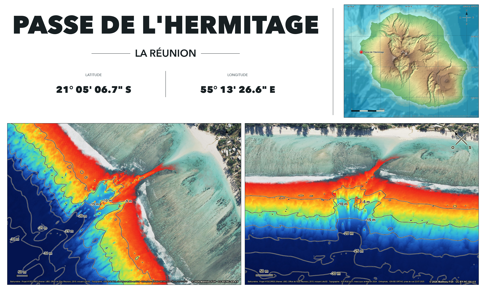 | 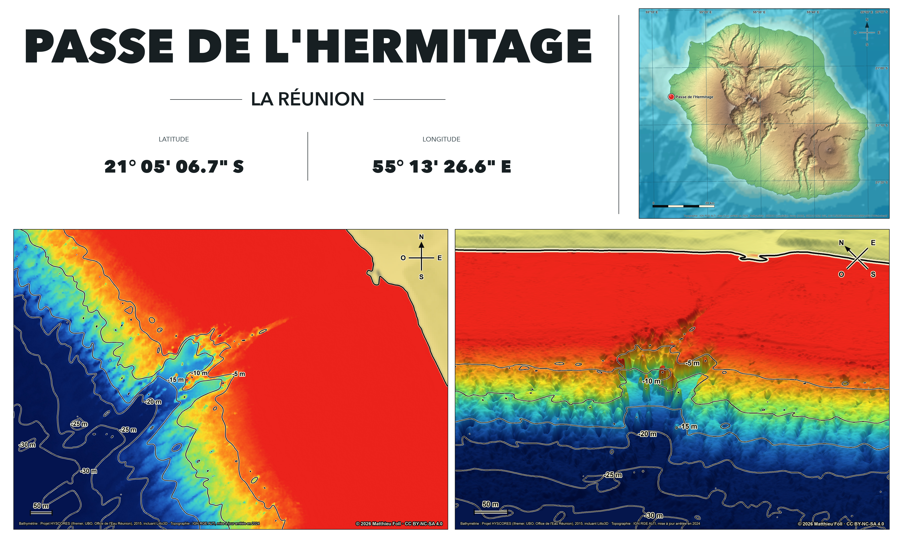 |

## Reliefs interactifs et Topo Réunion

Les reliefs 3D interactifs appartiennent au pipeline cartographique. Ils sont
generes sous `outputs/interactive-terrain/`, independamment du site :

```bash
.venv/bin/python generate_interactive_terrain.py
```

Chaque site produit un paquet compact compose d'un champ d'altitude, d'un
masque de validite, d'un masque de provenance des isobathes, de deux textures
et d'un fichier de metadonnees. Le format
et sa frontiere avec le site sont documentes dans
[INTERACTIVE-TERRAIN.md](INTERACTIVE-TERRAIN.md).

Le site se trouve dans `site/`. Il presente les rendus responsifs, conserve un
seul visuel actif lorsque le fond topographique ou l'orthophoto change, propose
les quatre cartes statiques originales correspondant a la vue et au fond actifs
ainsi que les planches HD au telechargement, et visualise les paquets 3D avec
rotation, zoom, deplacement et remise a zero de la camera.

Les ressources publiees restent des derives reproductibles des sorties
cartographiques canoniques :

```bash
cd site
../.venv/bin/python scripts/build_map_assets.py
../.venv/bin/python scripts/sync_interactive_terrain.py
npm test
```

Chaque relief interactif utilise une geometrie compacte commune aux deux styles.
Le bouton Topographie / Vue aerienne ne remplace que sa texture. Le nom
`orthophoto` reste reserve au format interne et aux fichiers reproductibles. La camera
initiale reprend l'azimut de la vue 3D imprimee et se place a l'oppose, cote
large ; son centre horizontal peut aussi reprendre celui du cadrage statique.
Le champ d'altitude compte au maximum `513` sommets sur son plus grand axe :
ce plafond augmente le detail du relief sur les grandes emprises tout en
conservant un paquet adapte au navigateur et aux appareils mobiles.
La rotation horizontale est libre sur 360 degres. Une rose dynamique conserve
les points cardinaux pendant les mouvements. Les isobathes sont calculees dans
des plans horizontaux tous les 5 m, avec un coeur qui reprend la couleur
bathymetrique de chaque profondeur, un liseré noir, une legende fixe a l'ecran
et un bouton d'affichage. Les GeoTIFF sources
restent dans le cache local et ne sont jamais publies.

Les textures WebGL sont produites depuis les rasters de contexte. Chaque site
declare un `interactive_footprint_utm40s` : un rectangle oriente comme la vue,
approximativement parallele a la cote, plus large que le cadrage initial sur
terre comme sous l'eau. Son rectangle englobant nord en haut sert au recadrage,
puis le masque oriente conserve exactement l'emprise declaree. Les textures
sont reechantillonnees au besoin avec un
maximum de `2048 px` sur leur plus grand cote. Elles sont distinctes des
textures de contexte utilisees par les JPEG 3D statiques, dont la resolution
configuree varie de 20 a 80 cm selon l'emprise.

## Installation sur macOS

Homebrew est requis. Le script installe Python et GDAL, puis cree un environnement local :

```bash
./bootstrap_macos.sh
```

L'environnement de reference enregistre pour les sept sites publies est Python 3.14, GDAL 3.13.1, NumPy 2.5.1 et Pillow 12.3.0. NumPy et Pillow sont epingles dans `requirements.txt`; Python et GDAL proviennent de Homebrew. Le preflight exige les polices macOS Arial, Arial Bold et Avenir Next utilisees par les cartes et les planches, au lieu de substituer silencieusement une police differente.

## Regeneration complete

```bash
.venv/bin/python generate_reunion_topobathy.py sites/cap-la-houssaye.json --refresh
```

Sans `--refresh`, les GeoTIFF deja mis en cache sont reutilises. Pour refaire uniquement les images :

```bash
.venv/bin/python generate_reunion_topobathy.py sites/cap-la-houssaye.json --render-only
```

Avant toute reutilisation, le script controle que les rasters du cache correspondent aux URL et couches configurees, a la projection, aux emprises, aux resolutions, au nombre de bandes et aux plages de valeurs attendus. Un manifeste local conserve aussi le SHA-256 de chaque raster. `--render-only` refuse donc un cache absent, modifie ou obsolete au lieu de rendre silencieusement des donnees incompatibles. Pour verifier seulement la configuration, les sources declarees et le cache sans produire d'image :

```bash
.venv/bin/python generate_reunion_topobathy.py sites/cap-la-houssaye.json --check
```

`--refresh`, `--render-only` et `--check` sont mutuellement exclusifs. Les donnees sources, les extraits regenerables et le manifeste `<slug>-cache-manifest.json` restent dans `.tmp/bathy-renders/` et ne sont pas versionnes. Toute modification d'une URL, d'une couche, d'une date, d'une emprise ou d'une resolution impose `--refresh`.

Pour assembler les deux planches apres leur regeneration :

```bash
.venv/bin/python compose_site_plate.py sites/cap-la-houssaye.json
```

Pour recalculer uniquement les deux perspectives 3D sans toucher aux plans 2D
ni a la carte de localisation :

```bash
.venv/bin/python generate_reunion_topobathy.py sites/cap-la-houssaye.json --render-only --relief-only
```

L'option `--land-style orthophoto` ou `--land-style topography` permet de ne regenerer qu'une seule variante. Sans option, les deux sont produites.

Les perspectives statiques utilisent le meme langage lumineux que le relief
WebGL : normales metriques calculees avec l'exageration verticale, lumiere
hemispherique froide et lumiere directionnelle chaude venant du nord-est. Le
calcul est effectue en espace colorimetrique lineaire avec une exposition
commune de `1.55`, avant le dessin des isobathes, du trait de cote et des
annotations. Cette exposition fait partie du modele lumineux ; ce n'est pas
une correction appliquee au JPEG final.

La couche BD ORTHO est diffusee a 20 cm, mais la resolution de travail de la
texture 3D statique est choisie par site en fonction de l'emprise et du cout de
calcul. Les valeurs publiees vont de 20 a 80 cm, comme indique dans le tableau
ci-dessus. Le telechargement est automatiquement decoupe en tuiles IGN puis
assemble sur une grille georeferencee unique. Le moteur conserve cette texture
independamment du maillage et interpole les facettes qui occupent plusieurs
pixels dans l'image finale.

## Reutilisation

Pour ajouter un site, copier une configuration de `sites/`, puis modifier le raster HYSCORES exact dans `hyscores_tiff_url`, les emprises UTM 40S, les resolutions, la date de l'orthophoto, le traitement de la cote et les parametres de camera. Ne pas recopier une date de prise de vue ou une correction locale depuis un autre site. Le plan 2D reste toujours nord en haut; la vue 3D accepte un azimut arbitraire et son compas est recalcule automatiquement. `sites/boucan-canot.json` montre comment traiter une cote non monotone; `sites/passe-hermitage.json` documente le cas d'un grand lagon et d'une vue oblique tournee a `45°`.

Le processus complet, les sources, chaque parametre et les controles qualite sont documentes dans [WORKFLOW.md](WORKFLOW.md).

Ces cartes sont des aides a la lecture du relief et a l'orientation generale. Elles ne prouvent ni l'acces au site, ni son autorisation, ni les conditions presentes, et ne remplacent jamais les informations locales ou une evaluation de securite.

## Licences

- Le code Python et les scripts sont distribues sous licence [MIT](LICENSE).
- Les cartes et figures de `outputs/` sont distribuees sous [CC BY-NC-SA 4.0](LICENSE-MAPS.md), sous reserve des droits attaches aux donnees sources.
- Les licences, attributions obligatoires, versions des jeux de donnees et avertissements sont detailles dans [THIRD-PARTY-NOTICES.md](THIRD-PARTY-NOTICES.md).

La licence `CC BY-NC-SA`, plutot que `CC BY-NC-ND`, est imposee par la clause de partage dans les memes conditions du MNT HYSCORES. Les cartes ne doivent pas etre utilisees pour la navigation ni comme base d'une decision engageant la securite en mer.
