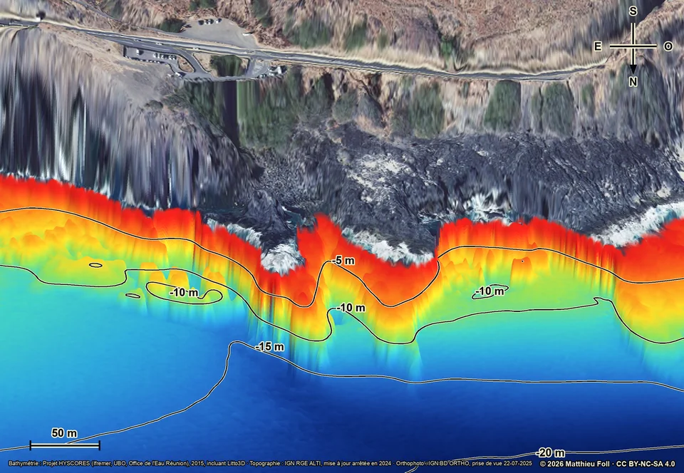
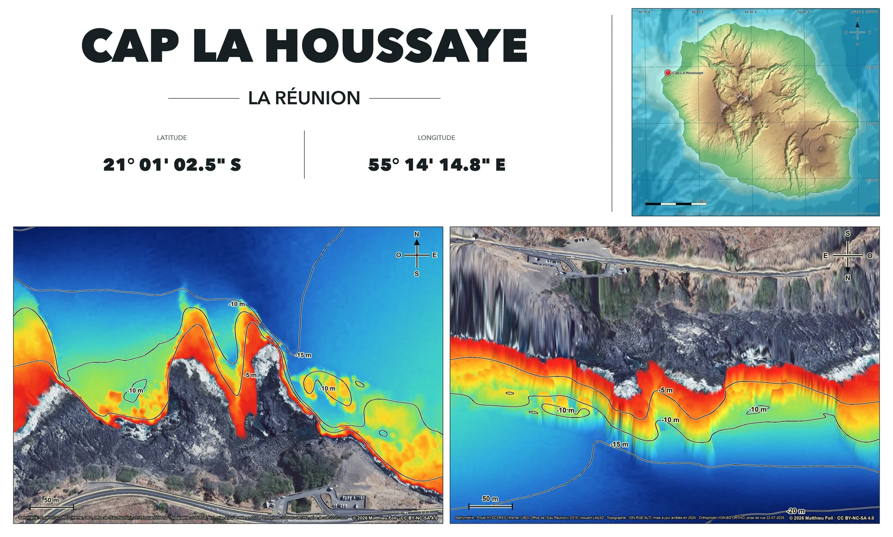

[**English**](README.md) · [Français](README.fr.md)

# Topo-bathymetric dive-site maps of Réunion Island

> [!IMPORTANT]
> To view the maps, explore the interactive 3D terrain and download the original high-resolution maps or printable sheets, visit **[Topo Réunion](https://reunion.divetopo.com)**.

[](https://reunion.divetopo.com)

## Why this project exists

While preparing a trip to Réunion Island, I found it surprisingly difficult to
locate detailed maps of its dive sites. Further research showed that useful
public bathymetric, topographic and aerial data already existed, but was not
easy to inspect together.

I therefore downloaded and assembled these datasets to produce consistent 2D
maps, static 3D perspectives, interactive terrain and printable sheets for a
small, non-exhaustive selection of sites. This repository is the technical
reference for that work: it contains the source code, site configurations,
workflow documentation and canonical generated outputs. The website is the
public interface for viewing and downloading the maps.

> [!NOTE]
> The codebase and the DiveTopo websites were generated entirely with AI, under human direction, iterative visual review and validation against the source data. The geographic data itself comes from the public institutional sources listed below.

## Data sources

| Used for | Source | Role in this project |
|---|---|---|
| Detailed seabed terrain | [Ifremer HYSCORES 2015](https://www.data.gouv.fr/datasets/mnt-bathymetrique-a-haute-resolution-des-fonds-marins-des-zones-recifales-de-la-cote-ouest-de-lile-de-la-reunion-2015) | High-resolution bathymetry for the west-coast reef sectors, including the Litto3D additions distributed within the HYSCORES product |
| Land elevation | [IGN RGE ALTI](https://cartes.gouv.fr/rechercher-une-donnee/dataset/IGNF_RGE-ALTI) | Digital terrain model for the land surface |
| Aerial imagery | [IGN BD ORTHO](https://cartes.gouv.fr/rechercher-une-donnee/dataset/IGNF_BD-ORTHO) | Georeferenced high-resolution imagery draped over land and, where configured, shallow water |
| Regional context | [GEBCO 2024](https://www.gebco.net/data-products-gridded-bathymetry-data/gebco2024-grid) | Regional seabed relief for the island locator and west-coast selection map |

All detailed processing uses WGS 84 / UTM zone 40S (`EPSG:32740`).
HYSCORES does not cover the whole island, so extending the project beyond its
four source sectors requires another numerical bathymetric source.

## What the pipeline produces

Each site is defined by an independent JSON configuration and produces:

- a north-up 2D map;
- a static oblique 3D perspective;
- topographic and aerial-imagery variants;
- an island locator;
- two printable high-resolution sheets;
- a compact interactive 3D terrain package consumed by the website.

The seven current sites use the same static-map dimensions
(`2474 × 1712 px`), apparent line weights and label scale. The printable sheets
measure `5400 × 3250 px`. In the aerial-imagery variant, imagery remains opaque
down to `−1.5 m`, fades smoothly to `−2 m`, and then gives way to the
bathymetric palette. The topographic variant retains the 0 m shoreline.

The engine merges the marine and land elevation models, interpolates the
shoreline at 0 m, smooths cell noise and extracts isobaths every 5 m. Raster
gaps remain unfilled by default. A documented deep-water boundary may be
completed locally with a uniform plateau at the configured maximum depth,
without inventing intermediate terrain or contours.

## Sites currently included

| Site | Municipality | Configuration |
|---|---|---|
| Cap La Houssaye | Saint-Paul | [`cap-la-houssaye.json`](sites/cap-la-houssaye.json) |
| Boucan Canot | Saint-Paul | [`boucan-canot.json`](sites/boucan-canot.json) |
| Passe de l'Hermitage | Saint-Paul | [`passe-hermitage.json`](sites/passe-hermitage.json) |
| Cap Homard | Saint-Paul | [`cap-homard.json`](sites/cap-homard.json) |
| Pointe au Sel | Saint-Leu | [`pointe-au-sel-sec-jaune.json`](sites/pointe-au-sel-sec-jaune.json) |
| Pont Rouge | Saint-Leu | [`pont-rouge-la-tortue.json`](sites/pont-rouge-la-tortue.json) |
| Plage du Cimetière | Saint-Leu | [`plage-cimetiere-saint-leu.json`](sites/plage-cimetiere-saint-leu.json) |

## Representative example: Cap La Houssaye

Cap La Houssaye uses the common `−1.5/−2 m` aerial-imagery transition while
retaining a local bridge correction in the 3D model. Its static oblique view
uses a `0.29` tilt, a `1.35` view-axis amplification and places the shoreline
at 54% of the image height. This framing shows both points without devoting too
much space to the comparatively uniform offshore seabed.

| 2D map | Static 3D perspective |
|---|---|
| [](https://reunion.divetopo.com) | [](https://reunion.divetopo.com) |

### Printable sheet

[](https://reunion.divetopo.com)

The images above are lightweight previews. Topo Réunion serves the original
static JPEGs and `5400 × 3250 px` sheets through its download buttons.

## Interactive terrain and website architecture

Interactive terrain belongs to the mapping pipeline rather than the website
builder. The canonical command is:

```bash
.venv/bin/python generate_interactive_terrain.py
```

Each site package contains a 16-bit height field, a validity mask, an isobath
source mask, two textures and metadata. The format and the boundary between the
mapping pipeline and the website are documented in
[INTERACTIVE-TERRAIN.md](INTERACTIVE-TERRAIN.md).

The website lives under `site/`. It consumes the canonical package without
recalculating its geometry, textures or camera. A single geometry is shared by
the Topography and Aerial imagery variants; switching the background only
changes the texture. The initial camera follows the static 3D view, looking
from offshore towards the coast, while horizontal rotation remains free over
360 degrees.

The height field uses at most `513` vertices on its longest axis. WebGL
textures use at most `2048 px` on their longest side. Isobaths are calculated
as perfectly horizontal planes every 5 m, use the corresponding bathymetric
palette color and remain optional in the viewer.

Responsive website assets are reproducible derivatives of the canonical
outputs:

```bash
cd site
../.venv/bin/python scripts/build_map_assets.py
../.venv/bin/python scripts/sync_interactive_terrain.py
npm test
```

The GeoTIFF source data remains in the local cache and is never published.

## Installation on macOS

Homebrew is required. The bootstrap script installs Python and GDAL and creates
the local environment:

```bash
./bootstrap_macos.sh
```

The recorded reference environment for the seven current sites is Python 3.14,
GDAL 3.13.1, NumPy 2.5.1 and Pillow 12.3.0. NumPy and Pillow are pinned in
`requirements.txt`; Python and GDAL come from Homebrew. The preflight also
requires the macOS Arial, Arial Bold and Avenir Next fonts used by the maps and
sheets.

## Reproducing the maps

Download or refresh the source data and regenerate a complete site:

```bash
.venv/bin/python generate_reunion_topobathy.py sites/cap-la-houssaye.json --refresh
```

Reuse the validated cache and regenerate only the images:

```bash
.venv/bin/python generate_reunion_topobathy.py sites/cap-la-houssaye.json --render-only
```

Validate the configuration, declared sources and cache without rendering:

```bash
.venv/bin/python generate_reunion_topobathy.py sites/cap-la-houssaye.json --check
```

Recalculate only the two static 3D perspectives:

```bash
.venv/bin/python generate_reunion_topobathy.py sites/cap-la-houssaye.json --render-only --relief-only
```

Assemble the two printable sheets:

```bash
.venv/bin/python compose_site_plate.py sites/cap-la-houssaye.json
```

`--refresh`, `--render-only` and `--check` are mutually exclusive. Use
`--land-style orthophoto` or `--land-style topography` to render only one land
style. Source data, reproducible extracts and each
`<slug>-cache-manifest.json` remain under `.tmp/bathy-renders/` and are not
versioned.

Static 3D perspectives use metric normals with vertical exaggeration, a cool
hemisphere light and a warm directional light from the north-east. Lighting is
calculated in linear color space with a common exposure of `1.55` before
isobaths, the shoreline and annotations are drawn.

## Reusing the pipeline for another site

Copy a configuration from `sites/`, then replace the exact HYSCORES raster,
UTM 40S extents, resolutions, aerial-image capture date, shoreline treatment
and camera parameters. Do not copy a source date or local correction from
another site without verifying it. The 2D map remains north-up; the 3D view may
use any azimuth and recalculates its compass automatically.

The full production procedure, every parameter and the quality checks are
documented in [WORKFLOW.md](WORKFLOW.md).

## Licenses and safety

- Python code and scripts: [MIT](LICENSE).
- Maps and figures under `outputs/`: [CC BY-NC-SA 4.0](LICENSE-MAPS.md), subject
  to the rights attached to the source data.
- Source licenses, mandatory attributions, dataset versions and warnings:
  [THIRD-PARTY-NOTICES.md](THIRD-PARTY-NOTICES.md).

The maps help interpret terrain and general orientation. They do not establish
access, permission, present conditions or safety. They must not be used for
navigation or as the sole basis for a decision affecting safety at sea.
